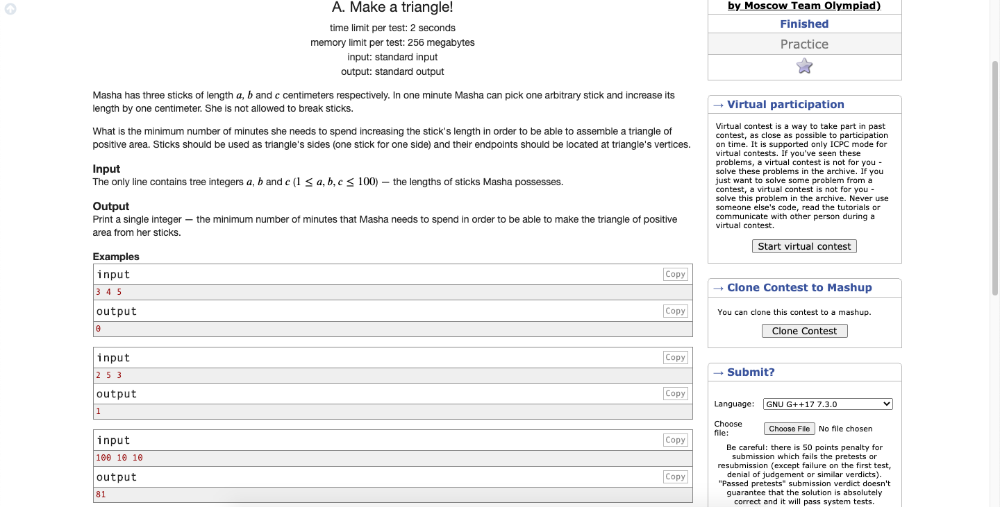

# Codeforces-1064A-Make-a-triangle-
### Problem

### Program Simulation
<pre>
  Sample Input: 3 4 5
  
  * Sort *
  
  print max(0, 5-(3+4-1))
  
  Final Output:
  0
  

  Sample Input: 2 5 3
  
  * Sort *
  
  print max(0, 5-(2+3-1))
  
  Final Output:
  1
  

  Sample Input: 100 10 10
  
  * Sort *
  
  print max(0, 100-(10+10-1))
  
  Final Output:
  81
</pre>
